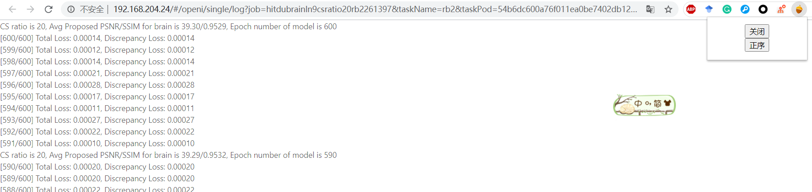
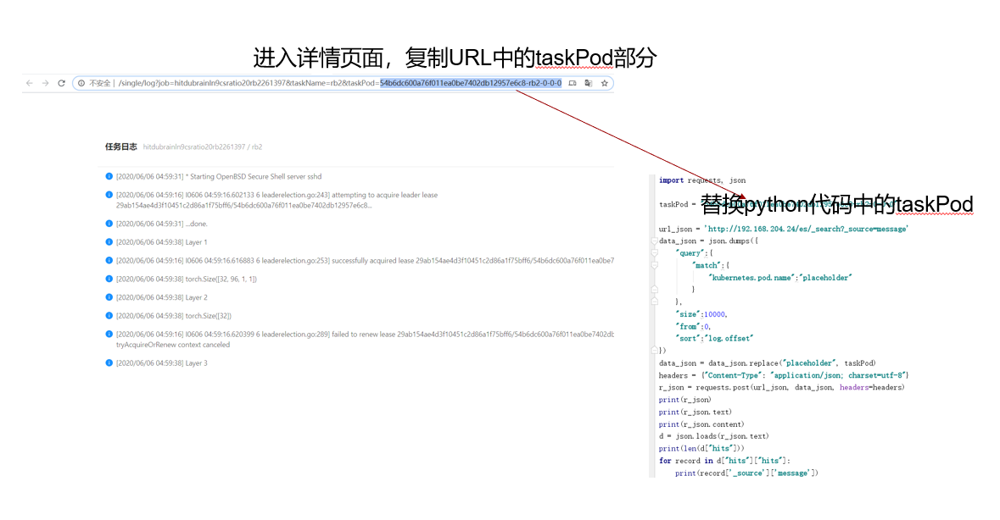
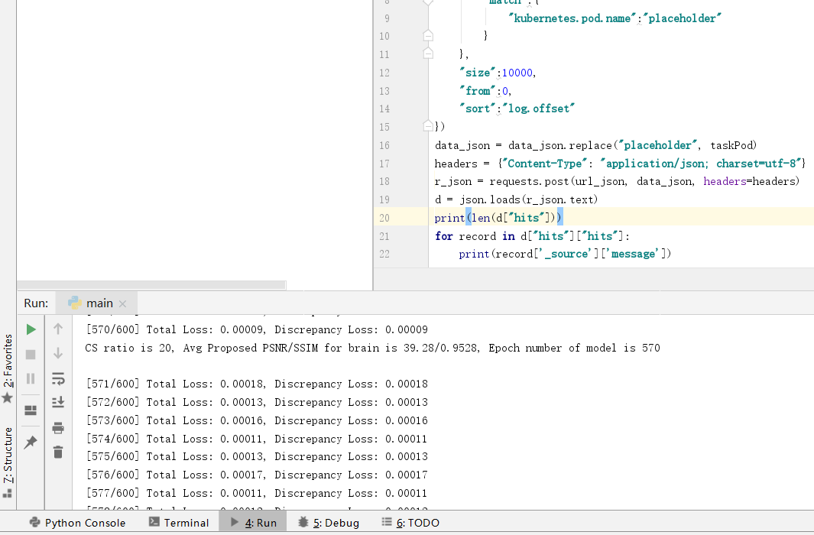

# YunnaoLogDownloader
# 用途
一次下载最多10000条新版云脑的log
# 用法
## Chrome插件
- 在地址栏输入chrome://extensions/
- 打开右上角开发者模式
- 下载crx文件，并解压
- 点击左上角的加载已解压扩展程序，选择你解压到的文件夹
- 点击松果的图标，可以切换正序倒序，以及开关插件

## python脚本
打开详情页，复制Taskpod参数，替换脚本中的Taskpod 

运行即可 

